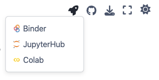

# Compute Environment

These tutorials can be run in any personal computing environment (e.g., desktop/laptops), on-premise solution (e.g., High-Performance Computing), or on the Cloud (e.g., Amazon Web Service).

The tutorials use [JupyterLab](https://jupyter.org/) to run the scripts and print the results. JupyterLab is a web-based interactive development environment for notebooks, code, and data. 

To install Jupyterlab with `pip`, run the following on the terminal:
```bash 
pip install jupyterlab
```

Once installed, type the following in your terminal: 
```bash
jupyter lab
```

The Jupyter notebooks can also be launched to external environments like Google's [Colab](https://colab.research.google.com/), [MyBinder](https://mybinder.org/) or other managed cloud environment like [NASA Openscape 2i2c](https://openscapes.2i2c.cloud/) using "launch buttons". The launch buttons can be accessed by clicking the {fa}`rocket` icon on the top-right corner of the Jupyter notebooks:



You can also [clone this repository](https://docs.aws.amazon.com/sagemaker/latest/dg/studio-lab-use-external.html#studio-lab-use-external-clone-github) to the [Amazon Sagemaker Studio Lab](https://studiolab.sagemaker.aws/), which is a free computing environment on the AWS cloud.
